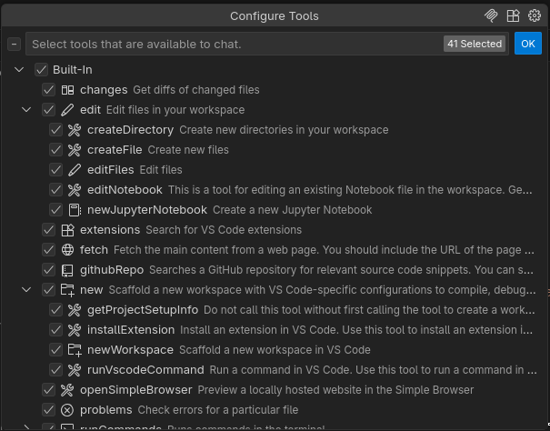

# AI Assistants

---
layout: two-cols-header
---

# Γιατί AI Assistant;

<v-clicks>

Και το Chatbot μια χαρα δε δουλευει?
</v-clicks>

::left::
<v-clicks>

✅ Απλά προβλήματα

- Custom Shortcode
- Custom Fee (woocommerce)
- Custom Template (ενα αρχειο)

</v-clicks>

::right::
<v-clicks>

❌ Πολύπλοκες υλοποιήσεις

- Ολόκληρο theme
- Custom Block
- Custom Post Type & Σελίδα Ρυθμίσεων

</v-clicks>

::bottom::
<v-clicks>

Λύση? - AI Assistant <span v-mark="{at: '7'}">μέσα στο IDE</span>
</v-clicks>

---
layout: two-cols-header
---

# Τι είναι ένας Agent;

::left::
<v-clicks>

- Ένα LLM, αλλά με **εργαλεία** (tools)
- Του επιτρέπουν να αλληλεπιδρά με τον κόσμο
  - Διαβάζει / γράφει αρχεία
  - Τρέχει εντολές
  - Αναζήτηση στο web

</v-clicks>

::right::
<v-click></v-click>

---
layout: cover
---


<span class="text-xs">Daniel Oberhaus (2017)</span>

<style>
img {
    margin: auto;
    height: 450px;
}
</style>

---

# Ζητάει άδεια!

&nbsp;

<v-clicks>


<v-drag-arrow color="#f00" pos="34,313,95,65"/>


<v-drag-arrow color="#f00" pos="534,348,-173,105"/>
</v-clicks>

---

# Agent Mode

<v-clicks depth=2>

- Επιτρέπει στον agent να τρέχει σε loop
- Πχ. "Προσθεσε ενα flag στην get_my_post()"
    - 🔎 αναζητηση στο codebase για `get_my_post`
    - 📄 διαβασμα αρχειου `my-plugin.php`
    - ✏️ επεξεργασια αρχειου `my-plugin.php`
    - 📄 διαβασμα αρχειου `inc/utils.php`
    - ✏️ επεξεργασια αρχειου `inc/utils.php`
</v-clicks>

---

# Tip: "Plan Mode" 💡

<v-clicks depth=2>

Πριν απο μεγαλα τασκ, ζητα του να το σχεδιασει

Χωρις "Plan Mode"

```
Φτιάξε ένα νέο Custom Post type (αγγελία) με καποια βασικα πεδια
```

Με "Plan Mode"

```
Φτιάξε ένα νέο Custom Post type (αγγελία) με καποια βασικα πεδια. 

Πριν ξεκινησεις την υλοποιηση, παρουσιασε μου το σχεδιο σου. Ρωτα με για οτι διευκρινησεις χρειαζεσαι
```

<v-drag-arrow pos="568,266,-121,60"/>

</v-clicks>
