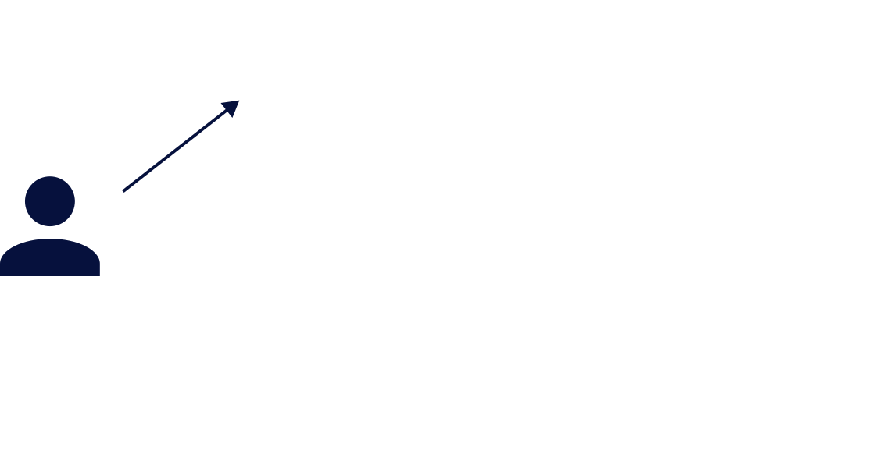
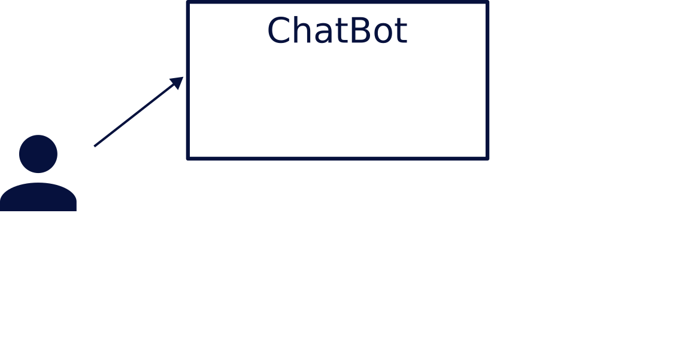
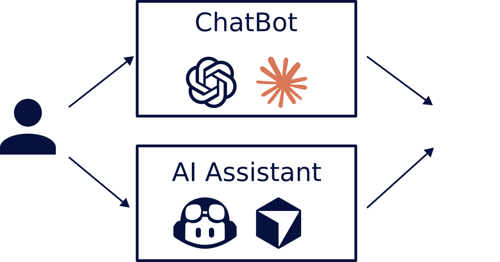

# Βασικά

---

# Τι είναι το "ΑΙ"

<v-clicks depth="2">

- 1959: Όρος Μηχανική Μάθηση
    - αλγοριθμοι που μαθαινουν απο δεδομενα χωρις οδηγιες
- ...
- 2017: Διατριβή "Attention is all you need" - Google
- Το πρώτο LLM (Μεγάλο Γλωσσικό Μοντέλο) - OpenAI
    - 2019: GPT-2 (1.5B παράμετροι)
    - 2020: GPT-3 (175Β παράμετροι)
- 2022: ChatGPT
</v-clicks>

<v-click> 

Στην καθημερινότητά μας πλέον, ΑΙ = LLM
</v-click> 

---

# LLM (1/3)

<v-clicks>

Σκεφτείτε LLM = 📱

## Κατασκευαστής
</v-clicks>
<v-clicks>

- 📱 Apple, Samsung, Xiaomi
- 🧠 OpenAI, Anthropic, Google
</v-clicks>
<v-clicks>

## Μοντέλο <v-click at="8">Έκδοση</v-click>
</v-clicks>
<v-clicks>

- 📱 iPhone 15, iPhone 16, iPhone 17
- 🧠 gpt-3, gpt-4, gpt-5
</v-clicks>

---

# LLM (2/3)

Σκεφτείτε LLM = 📱

<v-clicks>

## Μέγεθος
</v-clicks>
<v-clicks>

- 📱 17, 17 Pro, 17 Pro Max
- 🧠 gpt-5-nano, gpt-5-mini, gpt-5
</v-clicks>

<v-clicks>

## Μνήμη
</v-clicks>
<v-clicks>

- 📱 256GB, 512GB
- 🧠 250K, 400K, 1M
</v-clicks>

---

# LLM (3/3)

Σκεφτείτε LLM = 📱

<v-clicks>

## Thinking
</v-clicks>
<v-clicks>

- 📱 ❓❓❓
- 🧠 thinking / non-thinking
</v-clicks>

 
<v-click>

"Εσωτερικός Διάλογος"
</v-click>

---

# Διεπαφές

<v-switch>
<template #1></template>
<template #2></template>
<template #3></template>
<template #4></template>
<template #5></template>
<template #6></template>
<template #7></template>
<template #8></template>
<template #9></template>
<template #10></template>
<template #11></template>
</v-switch>

