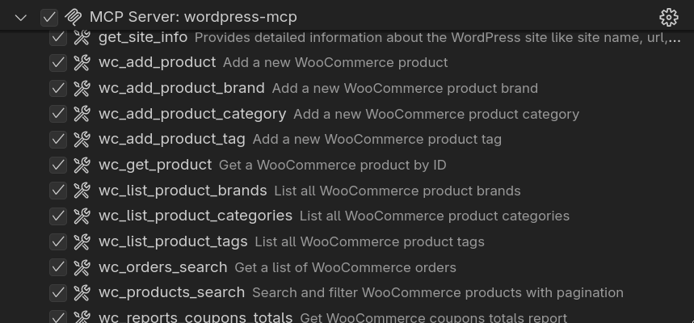
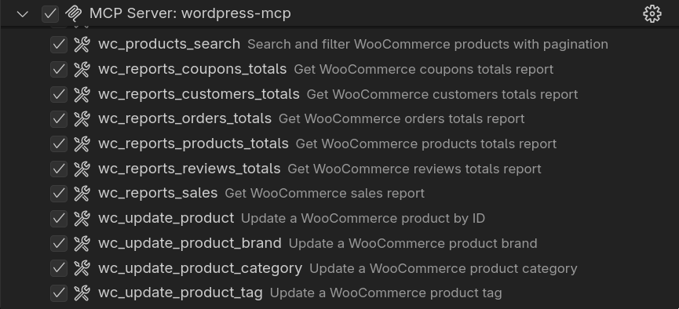

# MCP & WordPress

---

# Τι είναι το MCP;

<v-clicks>

**Model Context Protocol** (απλά)

- Πρωτόκολλο που επιτρέπει στο AI να συνδέεται με εφαρμογές
- Στην περίπτωσή μας: **AI που συνδέεται στο WordPress**
- Διαχείριση περιεχομένου με φυσική γλώσσα

</v-clicks>

---

# Πώς λειτουργεί;

<v-clicks depth=2>

1. **MCP Server** στο WordPress (plugin)
2. **AI Assistant** Συνδέεται με το MCP server
3. **Εσύ** Ζητάς με φυσική γλώσσα αυτό που θες
</v-clicks>

---
layout: two-cols-header
---

# Διαθέσιμα Εργαλεία

::left::



::right::



---
layout: cover
---

# Παραδείγματα

---

# Παράδειγμα 1: SEO

<v-clicks>

```
Βελτιστοποίηση meta descriptions για όλα τα προϊόντα
```

```
Ενημέρωσε όλα τα alt texts των εικόνων με βάση το περιεχόμενο
```

```
Δημιούργησε SEO-friendly slugs για όλα τα posts
```

⚠️ Πάντα κρατάμε backup πριν από μεγάλες αλλαγές

</v-clicks>

---

# Παράδειγμα 2: Μετάφραση

<v-clicks>

```
Φτιάξε τίτλους και περιγραφή στα αγγλικά για όλα τα προϊόντα, σε κατάσταση Προσχέδιου
```

```
Μετάφρασε όλες τις σελίδες του menu στα Γερμανικά, σε κατάσταση Προσχέδιου
```
</v-clicks>

---

# Παράδειγμα 3: Στοιχεία Περιεχομένου

<v-clicks>

```
Βρες όλα τα άρθρα που δεν έχουν featured image
```

```
Ποια προϊόντα έχουν ελλιπείς περιγραφές;
```

```
Πάρε τα άρθρα με τα περισσότερα σχόλια, και βρες τι κοινό έχουν
```

</v-clicks>

---

# Πως το χρησιμοποιώ;

<v-clicks>

⚠️ Το MCP βρίσκεται σε στάδιο μετάβασης

Μόνο μέσω github

Παλιό plugin - Automattic/wordpress-mcp ✅

Νέο plugin - WordPress/mcp-adapter 🚧
</v-clicks>

<style>
.slidev-layout p {
    margin-bottom: 50px;
}
</style>

---

# Το μέλλον του WordPress

https://github.com/WordPress/ai

<v-clicks depth=2>

- AI Playground - Πειραματισμός με διαφορετικούς παρόχους και μοντέλα
- Content Assistant - Δυνατοτητες για γράψιμο από ΑΙ μέσα στον Gutenberg
- Site Agent - Διαχείριση σελίδας με φυσική γλώσσα
- Workflow Automation
    - Δημιουργία τίτλων
    - Δημιουργία αποσπασμάτων (σύνοψη)
    - Σύνοψη περιεχομένου
    - Έξυπνο Tagging
- Media Enhancement
    - Δημιουργία Alt Text
    - Δημιουργία Εικόνων
</v-clicks>

<style>
li {
    font-size: 1rem;
}
</style>

