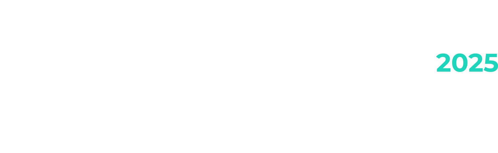

# Beyond ChatGPT
## AI Toolkit for the WordPress Developer

  WordCamp 2025

  Φίλιππος Καραϊλανίδης @ ByteRail

---
layout: two-cols-header
---

# Για ποιον είναι αυτή η ομιλία;

<v-clicks>

- Κάνεις contribute στο WordPress?
- Γράφεις δικά σου plugin?
- Γράφεις δικά σου themes?
</v-clicks>

 
<v-clicks>

Τίποτα απ' όλα αυτά?

🎁
</v-clicks>

---

# Τι θα καλύψουμε

<v-clicks>

- 🔍 Τι είδους AI εργαλεία υπάρχουν
- 🛠️ Πώς να τα αξιοποιήσουμε αποτελεσματικά
- 🔌 Πώς να τα κάνουμε WordPress-specific

</v-clicks>
---
src: ./modules/foundation.md
---

---
src: ./modules/ai-assistants.md
---

---
src: ./modules/wordpress-usecases.md
---

---
src: ./modules/mcp-usecases.md
---

---
layout: cover
background: /assets/wordcamp-bg.jpg
class: text-center
---

# Σας ευχαριστώ πολύ

  Φίλιππος Καραϊλανίδης @ ByteRail

---
layout: cover
background: /assets/wordcamp-bg.jpg
class: text-center
---

# Ερωτήσεις

  Φίλιππος Καραϊλανίδης @ ByteRail

